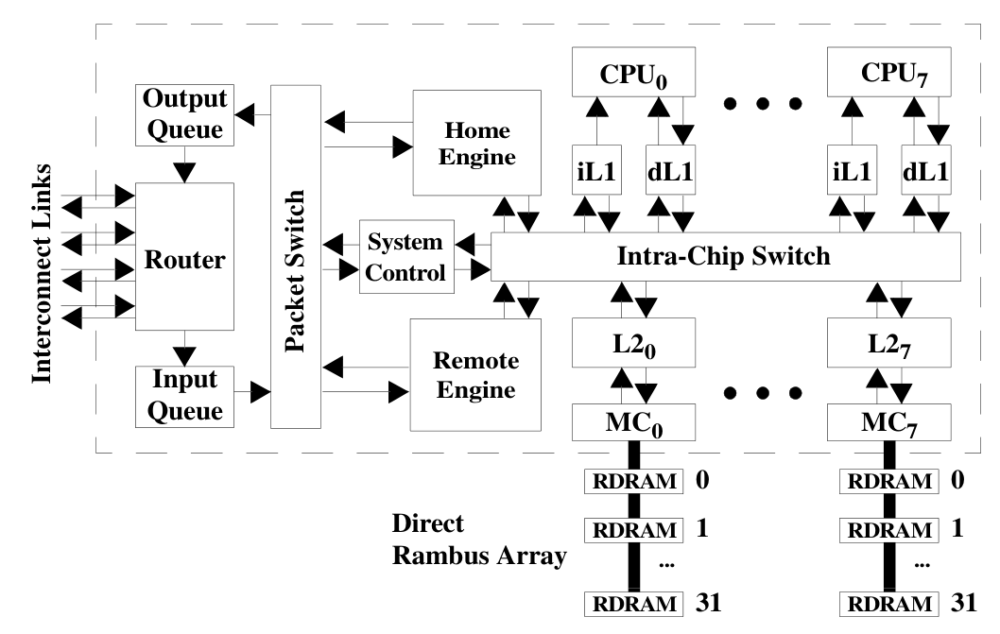
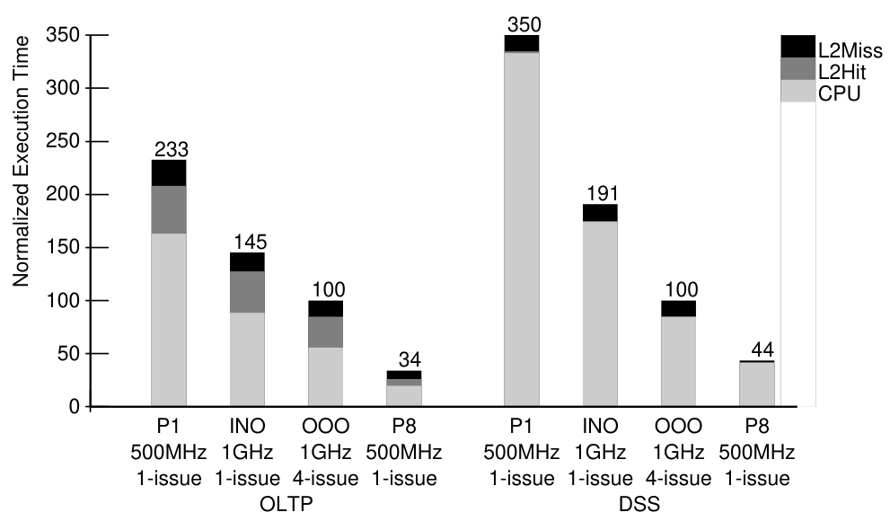

+++
title = "Piranha: A Scalable Architecture Based on Single-Chip Multiprocessing"
[extra]
[[extra.authors]]
name = "Sam Shaaban (Blogger)"
[[extra.authors]]
name = "Isaac Lonergan (Presenter)"
[[extra.authors]]
name = "Mykyta \"Nick\" Syntsia (Presenter)"
[[extra.authors]]
name = "Darren Mai (Scribe)"
[[extra.authors]]
name = "Shubhangi Pandey (Scribe)"
[[extra.authors]]
name = "Nat Rurka"
[[extra.authors]]
name = "Adam Bobich"
+++

# Introduction
- Preceding the release of this paper in June of 2000, most processors were single core with a little slower than modern clock speeds at around 1 GHz.
- This marks the end of the era of clock speeds increasing exponentially over time.
    - Just a few years before, clock rates were in the 100's of MHz.
    - In the 25 years since then, CPUs have reached around 6-8 GHz at the upper end.

## Methods For Improving Performance
Without the ability to increase clock rates, performance gains mainly come from reducing memory latency and increasing parallelism.

### Instruction Level Parallelism (ILP)
- Instruction level parallelism is a method of allowing multiple instructions to be executed in parallel for a single thread of execution running on a single core.
- Methods of implementation include:
    - Pipelining
    - Out-of-Order (OoO) execution
    - Speculative execution / branch prediction
    - Very Large Instruction Word (VLIW) sets
- Has a relatively low ceiling to potential performance gains, and can get complex quickly.
    - Pipelining is relatively easy to implement and industry standard at the writing of this paper leading to its use here in the pre-existing Alpha cores that were used.
    - VLIW can give performance gains in certain workloads that use the instructions, yet is heavily workload dependent.
    - More complicated ILP such as out-of-order execution requires careful engineering and has varying performance gains based on the workload.
- Especially for commercial workloads which tend to be more data-dependent like OLTP, most CPU time is spent on memory stalls instead of instruction execution. The more complex methods of OLP become less effective in this circumstance, as the majority of the delays are coming from memory fetches rather than instruction execution.

### Thread Level Parallelism (TLP)
- This paper introduces an alternative path for parallelism.
    - Utilize simple processor cores which minimize development costs.
    - Increase parallelism by adding multiple cores.
- This method increases parallelism of instruction execution as well as memory access.
- Fairly simple to implement and develop in hardware.
- Does add some complexity to the software side in handling safe access to shared memory.
    - ILP handles this for the programmer, allowing performance boosts for an unmodified program, but has a lower limit to its potential performance boost.

# Architecture
## Top Level
### Scalable Architecture
Designed to allow easy scaling and custom implementation for up to 1024 nodes (of below processor and I/O chips). 
- In this paper they explore a single chip with 8 cores.
- The optimal ratio of processor chips to I/O chips depends on the workload.
    - This architecture allows custom builds suited for specific commercial applications.

### Processor Chips
- 8 Alpha cores which each have their own L1 cache.
- 8 L2 banks each with their own memory controller (MC)
- Protocol engines - home and remote - to handle the safe and efficient sharing of memory within and across chips.
- A system control chip for miscellaneous maintenance related functions - system configuration, initialization, interrupts, exceptions and performance monitoring.
- Intrachip switch - connects all of the above together.
- A packet switch that connects the home and remote engines as well as the system control chip to the input and output queue for the system interconnect router.

### I/O Chips
- The processor chips don't have any I/O capability, instead they are connected to an I/O chip through the system interconnect.
- Almost identical in design to the processor chips, except:
    - They only include one alpha CPU core and one L2 bank.
    - Add a PCI/X interface with its own L1 cache in place of one of the cores.
- As seen by the programmer, the CPU core on the I/O chip is indistinguishable from the others.
- This CPU core provides instruction execution with lower latency access to I/O. Helpful for:
    - Device drivers
    - I/O interface virtualization (to provide an interface with control registers)
- Has a relatively small area compared to the multi-core processing chip, involves much less cache and logic.

## Components
### Shared L2 Cache
- Because L1 and L2 are the same size (1MB), maintaining data-inclusion in the L2 could potentially waste all of its capacity on data that's already in the L1s.
- Instead, the L2 stores a directory of all of the lines in each L1
    - Uses 32x less memory than storing copies of the data.
    - Helps to maintain a sense of ownership of each cache line to help maintain memory coherence.
    - Each line is either owned by the L2, exclusively owned by an L1 cache, or owned by one of the L1s that have it (typically the last requester).
- The L2's main purpose is as a victim cache for lines evicted from the L1s.
    - When something misses in the L2, the line is directly loaded into the L1 from memory, helping to lower the miss latency.
- The L2 is split into 8 banks, but all L1 caches have access to all banks through the intra-chip switch.

### Intra-chip Switch
- Optimized for bandwidth
    - At 32 GB/s or about 3 times the memory bandwidth, optimal scheduling becomes less important.
- Attached to protocol engines to handle memory management.
- Attached to our system interconnect's input and output queues to allow outsourcing of compute to other nodes.

### Protocol Engine
- Protocol engines are implemented as microprogrammable controllers and are identical except for the microcode they execute.
    - Home engine exports local memory.
    - Remote engine imports remote memory.
- Uses invalidation-based directory protocol to maintain inter-node coherence. 
    - When a remote node attempts to write to shared data it must:
        - Send a request for exclusive access to the nodes that share the data.
        - Wait until an acknowledgement is received.
    - This approach helps to avoid the use of negative acknowledgements, which can add a significant amount of latency to remote operations.

- Utilizes cruise-missile-invalidates (CMI), which allow invalidation of a large number of nodes from only a handful of messages.
    - Each invalidation packet visits and is relayed by multiple, predetermined nodes, generating a single acknowledgment once it reaches the final node.
    - Significantly decreases network traffic, limiting the required buffer space in the network.

# Performance Results
- Simulated and compared performance of the 500 MHz single chip 8 core Piranha CPU to a:
    - 500 MHz single-core Piranha
    - 1 GHz in-order processor
    - 1 GHz 4-issue (similar to threads) out-of-order processor
- Found that the 8-core Piranha gives 2.9x greater bandwidth than a next-generation (for the time) 1 GHz 4-issue OoO processor.

# Class Discussion
- Why microprocessors vs regular server processors (slow clock speeds?)
    - May have been confusion on the term "microprocessor". Micro is in terms of size, not necessarily speed or performance.
    - Clock speeds aren't that slow, the flagship at the time was around 1GHz single-cored, this paper tests clock rates of 500 MHz and 1GHz, while adding more cores to boost performance.
    - Simple base design allows growing to a large scale without much difficulty.
    - This paper was a sort of inflection point for the industry, at a time where Intel was investing in single-core optimization.
    - Intel continued on the path of single-core Out-of-Order processors for some time after this paper, with the first multicore CPUs hitting the markets from AMD around 5 years later.

- Maximizing single core performance is expensive and doesn't gain us very much in performance.
    - At the time of this paper (2000), CPU clocks had been climbing quickly, but began to reach a ceiling (1GHz then, ~5-10GHz now)

- Directory coherence
    - Use L2 as a sort of cache 
    - Can scale between individual packages that each include many cores

- Potential for memory bottlenecks in large parallel access
    - For reads, the data can be shared between caches instead of requiring a large amount of DRAM reads
    - Many writes must go to DRAM, where each operation must be serialized and sent to the memory controller.
    - Writes can be queued at the L2 cache, where the data can be shared / read to an adjacent cache.

- For some servers, the network becomes the bottleneck at serving requests.

# Conclusion
Around 5 years after this paper, dual-core CPUs began to enter the market. Nowadays, it would be difficult to find anything, even a phone or chromebook, with less than 8 cores. This shows just how effective the ideas in this paper were at improving performance for not only commercial workloads but desktop workloads as well. Through simulation and modelling, they managed to prove the efficacy of a design that is scaled through adding more cores, instead of making them more complex. Although it can hurt performance on workloads that only utilize a single-core, the large potential to boost performance has proven itself worth this cost. 

# AI Disclosure
- NotebookLM to summarize and search through paper.
- ChatGPT to aid in some research and provide revision notes.
