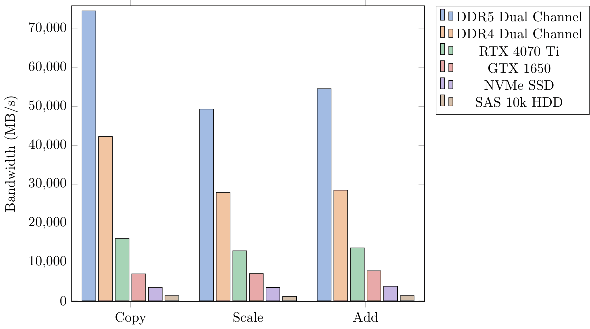
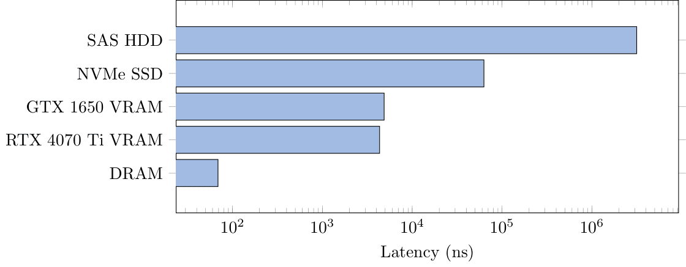
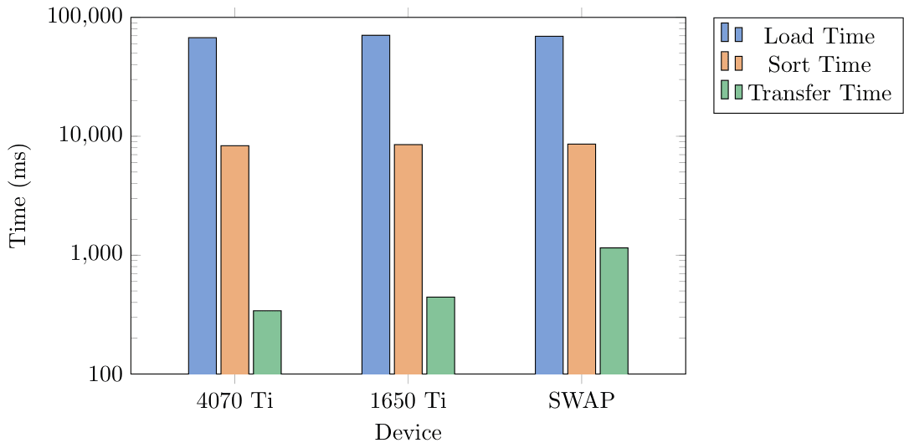
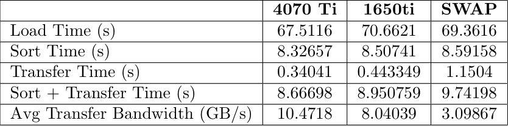
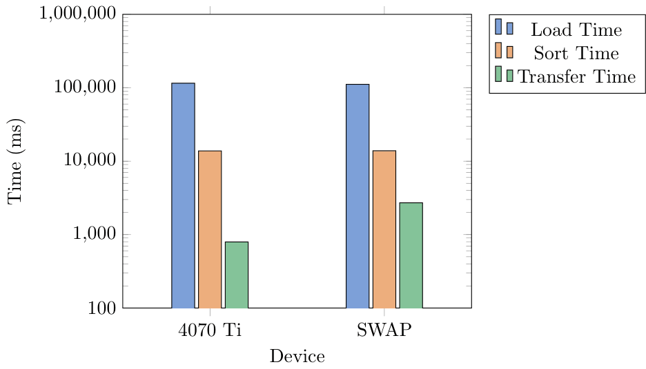
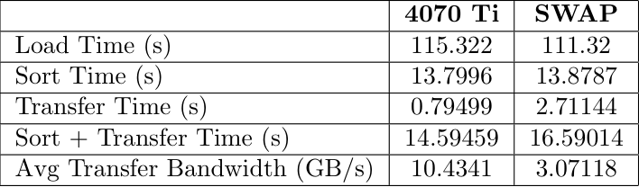
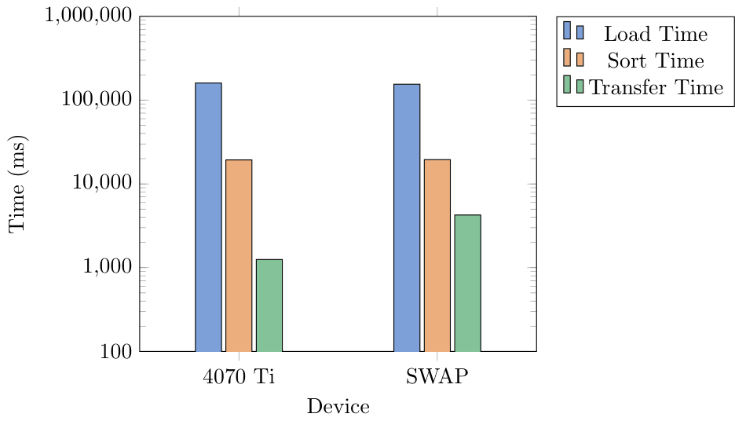
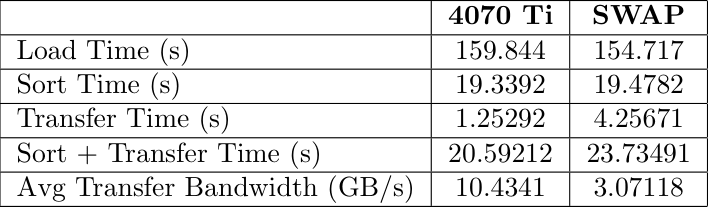
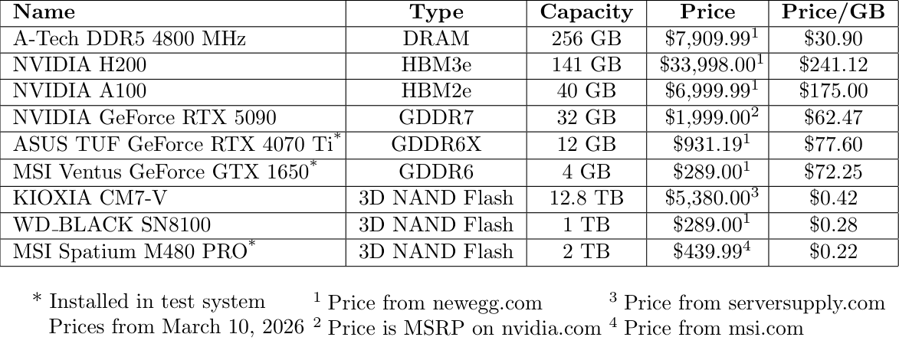

+++
title = "GPU as a Far Memory Tier"
[extra]
[[extra.authors]]
name = "John Aebi"
[[extra.authors]]
name = "Isaac Lonergan"
+++

# Introduction
There are many options for a memory tier that comes after the system RAM. One of these options may be the graphics memory onboard a graphics processor. Accessing this memory could happen over a high-speed PCIe link, the same one that drives currently use. The upside to using graphics memory instead of a storage device is the access speed.

# PCIe Limitations
The system we are using is limited to PCIe Gen. 4. This means a maximum bandwidth of 2 GB/s per lane. Therefore a 16 lane slot would be 32 GB/s. One of the cards we will be using to test, the GTX 1650, only uses PCIe Gen. 3, which has a maximum bandwidth per lane of 1 GB/s. This means that we will be limited to 16 GB/s maximum when using a 16 lane slot for this card. The other card we are using, the RTX 4070 Ti, uses PCIe Gen. 4 which has a maximum bandwidth per lane of 2 GB/s. This means that the absolute maximum for this card will be a bandwidth of 32 GB/s.

# CUDA and UVM
Unified virtual memory (UVM) is a system implemented in CUDA that allows the CPU and GPU to share an address space. This seems like a useful addition to this projects code. Because of the shared address space, UVM actually keeps the allocation in both places, updating each side as needed. This means that when we try and use the GPU as a swap space, the memory still resides on the system RAM. Instead of using UVM, we have decided to use cudaMalloc() and cudaMemcpy(). Using cudaMalloc() and cudaMemcpy() resulted in that block of memory being successfully moved off of the system memory and onto the graphics memory. Within cudaMemcpy() we experience significant overhead because the function must flush all pending GPU operations, source memory pages so the OS cannot move them, negotiate on the PCIe bus, and then block CPU threads until the DMA (Direct Memory Access) completion interrupt is received from the GPU. Every one of these steps cause latency on every individual call, which is why 29,202 calls creates hundreds of milliseconds of overhead that has nothing to do with actual data transfer. But it does have a lot to do with the overall system performance.

# Initial Benchmarks
At the beginning of this project, we took some initial measurements of bandwidth and latency. This was for us to see if this project could potentially be successful. The results of those tests showed that it could. These tests were performed across two systems. Three of the tests for DRAM, VRAM, and the NVMe SSD were conducted on a system with the following specifications:

**CPU**: Ryzen 9 5950x  
**Memory**: 2 x 16 GB DDR4 3600 MT/s  
**Storage**: MSI Spatium M480 PRO 2 TB NVMe SSD  
**Graphics**: NVIDIA GeForce GTX 1650, NVIDIA GeForce RTX 4070 Ti  

The system showed promising results, displaying clear memory tiers that we could follow. The bandwidth test was conducted by measuring the time to move data to CPU space, then perform a copy, scale, or add on the data, then return it to its respective memory. The latency test was performed by timing random traversal of an array where the next element depends on the currently accessed one. Because each element depends on the last, we will be able to measure an accurate latency without sequential reads.

# Application Specific Benchmark
For this tiered hierarchy we decided to test on a workload that would access memory from the GPU when CPU was full. We limited the CPU capacity to keep only 2GB in system RAM. We generated three different .csv files of sizes 6 GB, 10 GB, and 14 GB. These contained millions of data points that were randomized sensor data. The data included a timestamp, altitude, airpseed, pitch, roll, yaw, temperature, and pressure. We would sort this list by one column, moving a whole row at a time to keep the data together. This would then be written to an output file for validation. 

# Benchmark Results

**6GB Benchmark**

**10GB Benchmark**

**14GB Benchmark**

# Price Breakdown
It is very unlikely this is a good idea financially. A graphics processor has an on board processor that highly increases the manufacturing cost of the device. The table below shows a cost breakdown and price per gigabyte for different memory options:

The KIOXIA drive is more expensive per gigabyte due to the increased read speed. The MSI Spatium has a maximum read speed of 7400 MB/s and a maximum write speed of 7000 MB/s. The KIOXIA CM7-V has a maximum read speed of 14,000 MB/s and a write speed of 7,000 MB/s. The WD\_BLACK drive is put in as a price comparison to the GeForce GTX 1650 used for testing, showing that the price per gigabyte is far smaller when using NAND Flash. Obviously through these tests we prove that there is a smaller latency profile when using GPU as a tiered memory device but along with this the price per GB is significantly worse than any of the alternatives (even DRAM).

# What was hardest to get right?
We struggled the most to find a workload that could actually benefit from this increase in bandwidth. Larger transfers would always perform better on the GPU memory than SWAP, but smaller transfers were more similar in time. Additionally, we struggled a lot with using CUDA and keeping the memory organized throughout the project as a whole. Getting the system to not segmentation fault was one of the hardest tasks we encountered. Unified Virtual Memory was also a bit of a struggle point for us, as a copy of the memory would stay residing in system RAM instead of being moved fully to the GPU. To resolve this we eventually moved back to cudaMemcpy() which resulted in more complex data access.

# What was surprising?
Seeing the performance that this had was surprising to us as we expected the performance of the GPU memory to be worse due to the limitations of CUDA and the PCIe link we were using. Additionally we were surprised by how well swap actually can perform.

# Were we successful?
A GPU can function as a far memory tier for a system and it does provide some added benefits. The performance sits right between DRAM and SWAP/Disk. We believe that the cost of this implementation is too high for the performance gains measured. An alternate solution could be CXL or adding more RAM to the system.

# Repo
[https://github.com/isaaclonergan/gpu-memory-tier](https://github.com/isaaclonergan/gpu-memory-tier)
